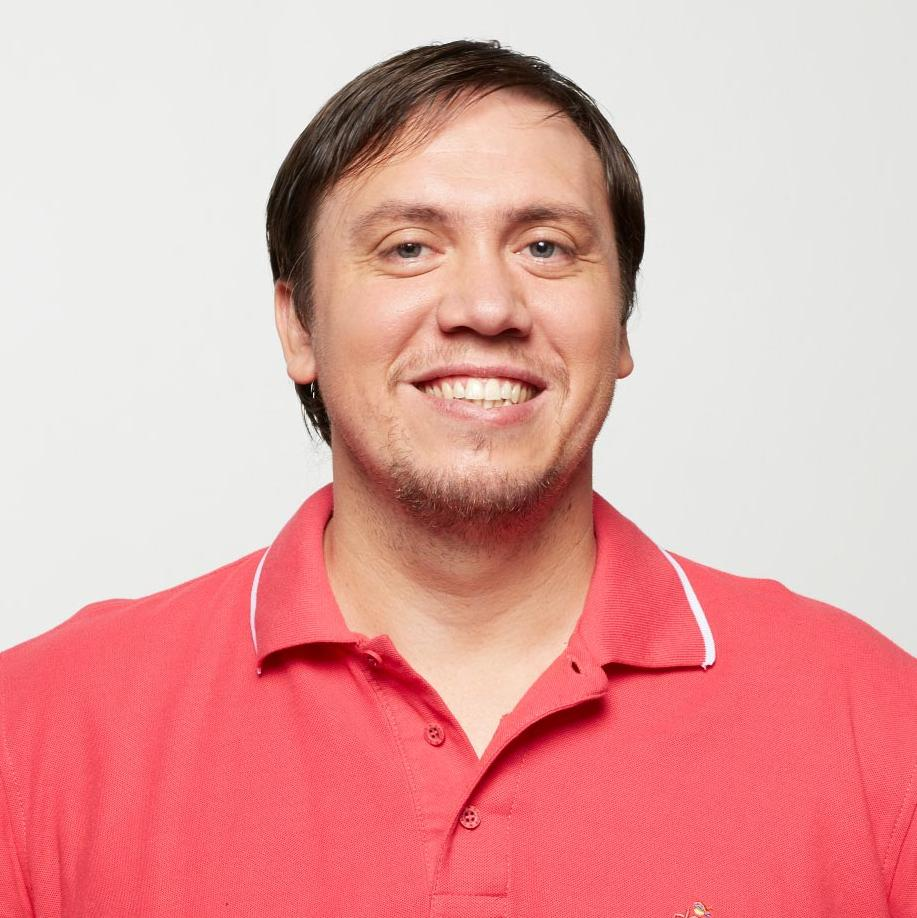

# Gastón Maximiliano Tonietti

## Contact

<table>
  <tbody>
    <tr>
      <td><strong>Address:</strong>&nbsp;</td>
      <td>602/318 Harris St, Pyrmont, NSW, 2009, Australia&nbsp;</td>
      <td rowspan="4"></td>
    </tr>
    <tr>
      <td><strong>Phone:</strong></td>
      <td>+61 437 447 857</td>
    </tr>
    <tr>
      <td><strong>Email:</strong></td>
      <td>gaston@tonietti.dev</td>
    </tr>
    <tr>
      <td><strong>Social:</strong></td>
      <td><a href="https://www.linkedin.com/in/gastontonietti">LinkedIn</a> | <a href="https://github.com/ktonga">GitHub</a></td>
    </tr>
  </tbody>
</table>

## Summary

I count with extensive experience designing, developing,
deploying and maintaining backend services in a variety of technologies
including Java, Scala and most recently Haskell.  
I pay special attention to quality, that's why I prefer to adopt
Functional Programming principles and techniques when I define tech-stacks.

In addition to my technical background I have played
leadership roles in several occasions throughout my career where I had,
among other things, to define and implement engineering processes, train
teams on new technologies and couch less experienced developers.

## Top Skills

- Design large and distributed systems
- Functional programming
- Research and evaluate new technologies
- Train and mentor less experienced developers
- Define development processes with focus on quality; such as CI/CD, TDD and code review

## Main Technologies

- Haskell, Servant, MTL, lens, amazonka, cabal
- Scala, cats/scalaz, zio, http4s, circe/argonaut, doobie/skunk, sbt
- AWS, ECS, S3, RDS, SQS, CloudFormation, GCP, Terraform
- PostgreSQL, Redis, Kafka, ElasticSearch, Cassandra, MongoDB
- Linux, Git, Nix, Docker

## Experience

### April (Sydney, Australia)

- **Senior Backend Developer** (February 2021 - Present)

  Working on the APIs that power white label BNPL for merchants and embedded finance for financial institutions.

  **Responsibilities and achievements**

  - Define and propagate coding best practices and styles with a focus on readability, extensibility and testability.
  - Reduce complexity and simplify maintainability of the codebase via continuous refactoring
  - Design, implement and adopt shared modules for solving cross-cutting concerns such as: HTTP authentication and authorization, error handling, structural logging, database access, etc.
  - Optimize CI/CD pipeline to reduce running time and resources usage
  - Integrate with third-party providers to enable some of our functionality such as: debt collection and support for payments via bank transfer, direct debit and pay-to

  **Technologies**

  - Scala, FP stack with cats, ZIO, tapir, http4s
  - MongoDB, Kafka, Redis
  - Google Cloud, Terraform, Kubernetes

### Zip Co Limited (Sydney, Australia)

- **Engineering Manager** (January 2020 - February 2021)
  
  Zip acquired a German company called Spotcap to power their line of credit for SMEs product.
  I was appointed as the technical leader to execute the integration of Spotcap's technology into Zip's ecosystem of products.

  **Tasks I had to perform/lead**

  - Go through a multi-week workshop for knowledge transferring to learn about the acquired technology
  - Orchestrate with other teams the soft integration of the new product (Zip products would redirect the user to the existing Spotcap instance)
  - Migrate Spotcap instance to Zip's infrastructure
  - Thorough rebranding of the product (domains, front-end apps, marketing website, comms, etc)
  - In depth integration of the new technology to power some aspects of Zip's products more directly

  **Technologies**

  - Scala
  - JavaScript/Node.js
  - MySQL
  - WordPress
  - AWS

### BrickX (Sydney, Australia)

- **Head Of Engineering** (February 2019 - January 2020)

  On top of my responsibilities as Principal Engineer, my responsibilities as
  Head of Engineering are:

  * To be aware of the status of all projects and report directly to the CEO of the company
  * Manage scope, long term planning and identify risks in all the different sub-systems of the platform
  * Optimise engineering resources to accommodate high level requirements from the business
  * Lead and supervise the day-to-day activities of the engineering team
  * Manage and execute project plans to achieve delivery commitments
  * Provide technical guidance and direction to team members
  * Ensure the profound understanding of already in use and new technologies
  * Define, implement and lead recruiting and mentoring processes
  * Collaborate closely with senior engineers and business experts to keep the software systems scalable and flexible in order to react quickly to sudden strategy changes
  * To be responsible for the correct functioning of the entire platform infrastructure and software

- **Principal Engineer** (May 2018 - February 2019)

  As a principal engineer, my main responsibilities are:

  - Set the technical direction for the on-line platform and the engineering team
  - Design the high-level architecture of decentralized services and how they interact with each other
  - Define the technical stack of each service based on pure functional programming libraries and practices 
  - Research new technologies to be always well informed about new tools which can benefit our systems
  - Implement development processes and coach members of the team to assure quality standards

### Ambiata (Sydney, Australia)

- **Senior Software Engineer** (January 2018 - April 2018) 

  I was part of the engineering team focused on design, implement and maintain a 
  set of services and tools written in Haskell to provide a highly efficient data
  pipeline for ML.

  **Technologies:** Haskell and several AWS services such as EC2, S3, EMR and DynamoDB.

### Simple Machines (Sydney, Australia)

- **Senior Scala Developer** (October 2015 - December 2017) 

  Principal backend developer: Design, implement, deploy and maintain several
  services making use of Functional Programming techniques and tech-stack
  such as Scalaz, Doobie, Http4s, Circe. Devops with Ansible and AWS.

- **Principal Consultant at Telstra** (January 2017 - November 2017)

  I was part of the team in charge to deliver a chatbots platform based on NLP
  external providers. The platform is used by different departments within the organisation
  such as marketing and costumer support to define automated interactive conversations with existing
  and potential customers.

  **Technologies:** Scala, Akka, IBM Watson

- **Principal Consultant at Commonwealth Bank** (January 2016 - November 2016)

  I was part of the Omnia Project, centralized Analytics Platform which provides
  Machine Learning services for Decisioning to different departments of the
  bank.

  **Technologies:** Scala, Hadoop, Spark

### Atlassian (Sydney, Australia)

- **Senior Scala Developer** (February 2015 - August 2015)

  I was part of Engineering Services, the team working on moving Atlassian
  products to the Cloud (OnDemand SaaS Platform).

  We made use of an efficient tech-stack strongly based on Functional Programming
  libraries and practices such as Scala, Scalaz, Event Sourcing, AWS, DynamoDB and Spray.io.

  We also paid special attention to quality, the codebase is deeply tested using
  Specs2, ScalaCheck and Gatling.

### Despegar.com (Buenos Aires, Argentina)

- **Software Architect - Flights Product** (January 2013 - January 2015)

  Ensure quality, performance and scalability for all the projects in the Flights
  Product Ecosystem.
  Research, implement and help with the coaching and adoption of cutting-edge
  technologies.

- **Technical Leader** (May 2011 - January 2013)

  I've led technically a team in the migration of a system from .Net to Java.
  I've also helped in the adoption of new processes and tools such as Kanban, Git,
  TestNG, among others.

### TeraCode (Buenos Aires, Argentina)

- **Java Architect** (January 2008 - April 2011)

  I was part of a team conformed by the most experienced developers
  in charge of evaluating and implementing new technologies, as well as
  defining new architectures and methodologies to be used in our products
  across the company.

  **Metodologies:** XP, Model Driven Design, Test Driven Development,
  Model View Presenter, Transparent Persistence, Continuous Integration.

- **Technical Leader** (January 2007 - April 2011)

  In charge of training and couching developers. Also referent for many
  technologies within the whole company.

- **Project Leader** (July 2006 - April 2011)

  I've led multiple teams of different sizes across many projects using different technologies.
  I was in charge of team tasks management, daily meetings with clients, releasing and deployments.

- **Java Developer** (July 2005 - April 2011)

  I've worked as developer in several Java-based projects from the very beginning of the company.

### Advansix (Buenos Aires, Argentina)

- **Web Developer** (June 2003 - July 2005)

  Development of many Dynamic-Content Web-Sites using a variety of
  programming languages such as ASP, PHP and Java, for different overseas customers.

## Other Experience

### Meetup Organiser

  * **2013 - 2015:** Scala User Group Argentina ([SUGAR](http://www.meetup.com/scala_ar/))

### Significant OSS Contributions

Merged Pull Requests [here](https://github.com/pulls?utf8=%E2%9C%93&q=is%3Apr+author%3Aktonga+archived%3Afalse+is%3Amerged+is%3Apublic+)

  * **2018:** ZIO
  * **2018:** Scalaz
  * **2013:** Akka
  * **2011:** Db4o

## Education

### Universidad Nacional de La Matanza

  * **1999 - 2003:** Informatics Engineering (unfinished)

### EET N° 8 de Haedo

  * **1993 - 1998:** Electronics Technician in Telecommunications

